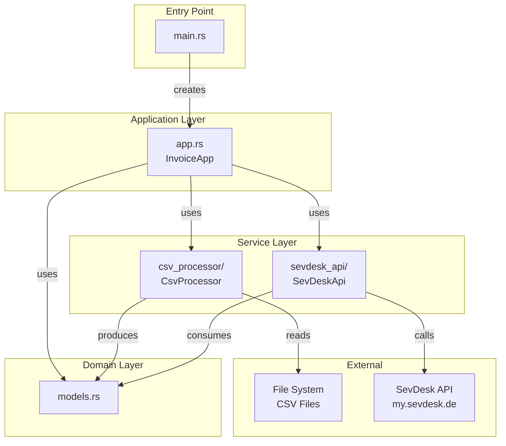
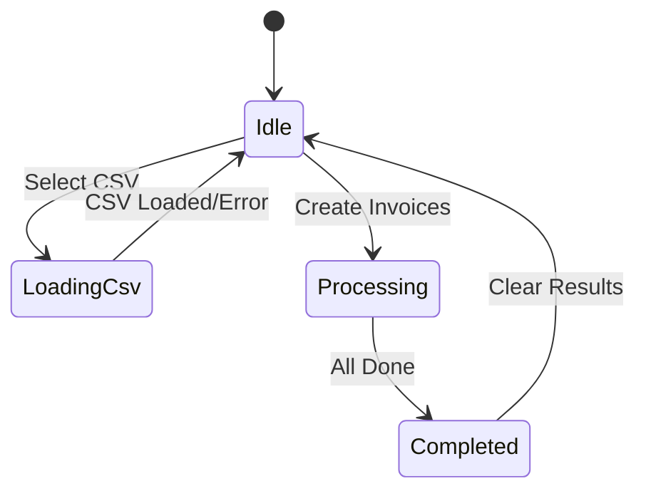
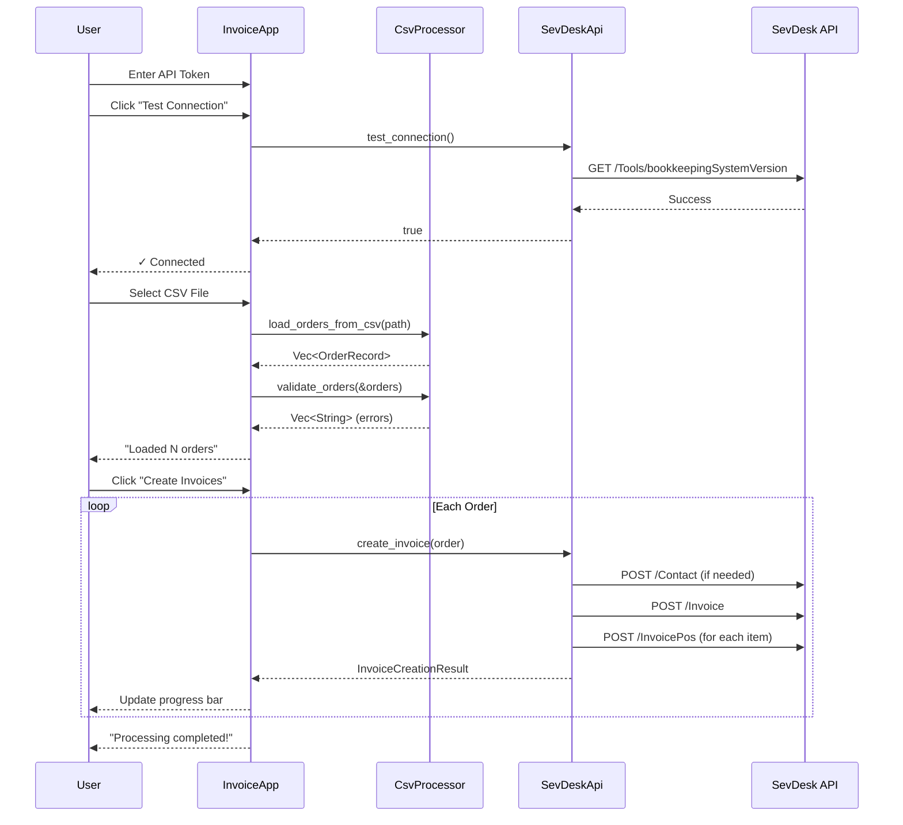

# SevDesk Invoicing - Source Architecture

This document describes the architecture of the SevDesk Invoicing application and how the components work together.

## High-Level Architecture



## Directory Structure

```
src/
├── main.rs              # Application entry point, GUI setup
├── lib.rs               # Library exports for testing
├── app.rs               # GUI application state and logic
├── app_tests.rs         # Unit tests for app.rs
├── models.rs            # Shared data structures
├── csv_processor/       # CSV parsing and validation
│   └── README.md        # Detailed module documentation
└── sevdesk_api/         # SevDesk API client
    └── README.md        # Detailed module documentation
```

## Module Overview

### main.rs - Entry Point

Initializes the application:
- Sets up `tracing_subscriber` for logging
- Configures `eframe` native window options (900x700 default size)
- Launches the GUI with `InvoiceApp`

```rust
fn main() -> Result<(), eframe::Error> {
    // Initialize logging
    tracing_subscriber::registry()...init();
    
    // Launch GUI
    eframe::run_native("SevDesk Invoice Creator", options, ...)
}
```

### lib.rs - Library Exports

Re-exports all public modules for use in integration tests:
- `pub mod app`
- `pub mod csv_processor`
- `pub mod models`
- `pub mod sevdesk_api`

### app.rs - GUI Application

The main application struct implementing `eframe::App`.

**State Management:**
```rust
pub struct InvoiceApp {
    api_token: String,                    // SevDesk API authentication
    csv_file_path: Option<PathBuf>,       // Selected CSV file
    orders: Vec<OrderRecord>,             // Parsed orders
    processing_state: ProcessingState,    // UI state machine
    results: Vec<InvoiceCreationResult>,  // Processing results
    api_connection_status: Option<bool>,  // Connection test result
    runtime: Runtime,                     // Tokio runtime for async
    validation_errors: Vec<String>,       // CSV validation errors
    dry_run_mode: bool,                   // Simulation mode toggle
}
```

**Processing State Machine:**


**Key Methods:**
| Method | Description |
|--------|-------------|
| `test_api_connection()` | Validates API token with SevDesk |
| `load_csv_file()` | Opens file dialog, parses CSV, validates orders |
| `process_invoices()` | Creates invoices (real or simulated) |

### models.rs - Data Structures

Shared data structures used across modules.

**Input Models (from CSV):**
| Struct | Purpose |
|--------|---------|
| `OrderRecord` | Parsed Cardmarket order with customer/item details |
| `OrderItem` | Individual item within an order |
| `CardRecord` | Card inventory data (alternative CSV format) |

**SevDesk API Models:**
| Struct | Purpose |
|--------|---------|
| `SevDeskContact` | Customer contact for API creation |
| `SevDeskInvoice` | Invoice data for API creation |
| `SevDeskInvoicePos` | Invoice line item |
| `InvoiceCreationResult` | Result of invoice creation attempt |

**API Response Models:**
| Struct | Purpose |
|--------|---------|
| `SevDeskResponse<T>` | Generic list response wrapper |
| `ContactResponse` | Contact lookup/creation response |
| `InvoiceResponse` | Invoice creation response |
| `StaticCountryResponse` | Country lookup response |

## Data Flow

### Complete Invoice Creation Flow



## Module Documentation

For detailed documentation on each submodule:

- **[CSV Processor](./csv_processor/README.md)** - CSV parsing, format detection, field parsing, and validation
- **[SevDesk API](./sevdesk_api/README.md)** - API client, contact management, country caching, invoice creation

## Key Design Decisions

### 1. Async Runtime in Sync GUI
The app uses a Tokio `Runtime` held in the `InvoiceApp` struct to bridge the synchronous egui framework with async API calls:
```rust
self.runtime.block_on(api.create_invoice(order))
```

### 2. Dry Run Mode
Simulation mode validates data and tests country resolution without creating actual invoices or contacts in SevDesk.

### 3. Format Auto-Detection
The CSV processor automatically detects whether a file contains order data or card inventory based on header columns.

### 4. Country Caching
Country IDs are cached after first fetch to avoid repeated API calls. The cache supports multiple name formats (local names, English names, aliases).

### 5. Kleingewerbe Tax Handling
All invoices use tax rule ID 11 (Kleinunternehmerregelung §19 UStG) with 0% VAT.

## Testing

```bash
# Run all tests
cargo test

# Run tests for a specific module
cargo test csv_processor
cargo test sevdesk_api

# Run with logging
RUST_LOG=debug cargo test
```

## Environment Variables

| Variable | Description | Required |
|----------|-------------|----------|
| `SEVDESK_API` | SevDesk API token | Optional (can enter in GUI) |
| `RUST_LOG` | Log level (e.g., `info`, `debug`) | Optional |
