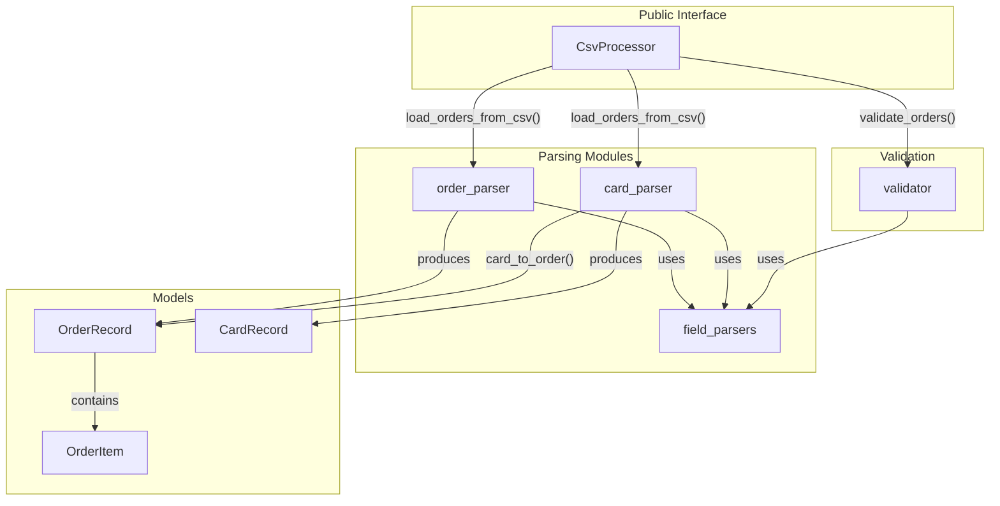
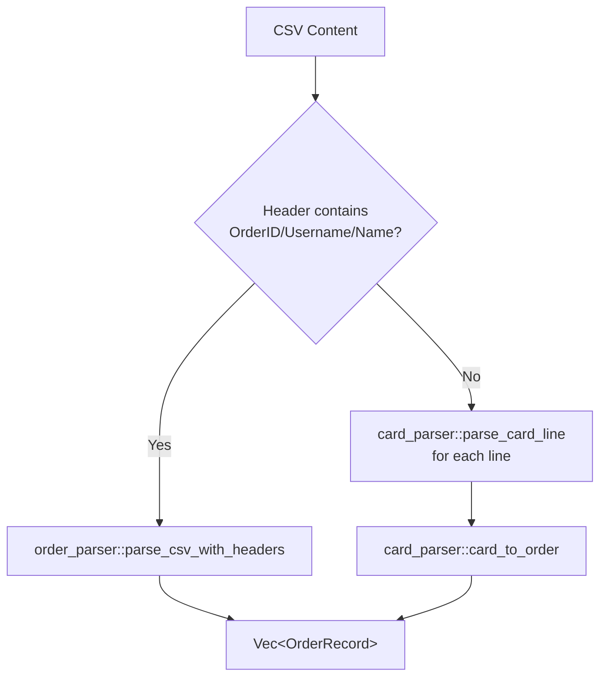
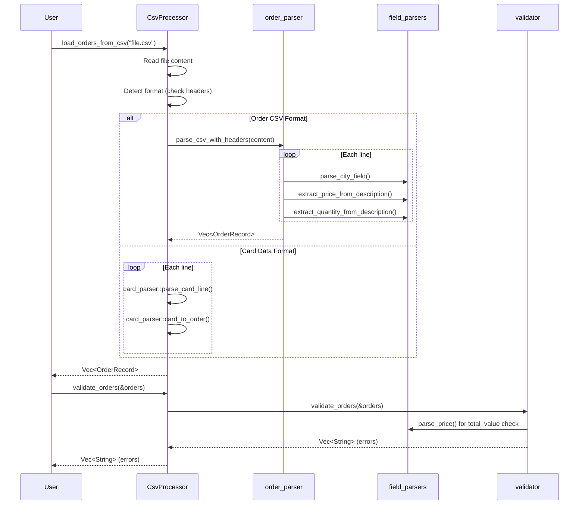

# CSV Processor Module

This module provides functionality for parsing CSV files exported from Cardmarket, including both order data and card inventory formats.

## Architecture Overview



## Module Structure

```
csv_processor/
├── mod.rs                 # CsvProcessor facade & format detection
├── field_parsers.rs       # Pure parsing utility functions
├── order_parser.rs        # Order CSV parsing (Cardmarket format)
├── card_parser.rs         # Card/inventory data parsing
├── validator.rs           # Order validation logic
└── *_tests.rs             # Unit tests for each module
```

## Components

### CsvProcessor (mod.rs)

The main facade that provides a unified interface for all CSV processing operations.

```rust
pub struct CsvProcessor;

impl CsvProcessor {
    pub fn new() -> Self;
    pub async fn load_orders_from_csv<P: AsRef<Path>>(&self, file_path: P) -> Result<Vec<OrderRecord>>;
    pub fn parse_csv_content(&self, content: &str) -> Result<Vec<OrderRecord>>;
    pub fn validate_orders(&self, orders: &[OrderRecord]) -> Vec<String>;
}
```

**Responsibilities:**
- Auto-detect CSV format (order data vs card inventory)
- Delegate parsing to appropriate submodule
- Provide validation interface

**Format Detection Logic:**


### field_parsers.rs

Pure utility functions for parsing individual fields. No state, no side effects.

| Function | Input | Output | Description |
|----------|-------|--------|-------------|
| `parse_price` | `"5,00"` or `"5.00"` | `f64` | Handles comma/dot decimals |
| `parse_city_field` | `"10557 Berlin"` | `(zip, city)` | Splits postal code from city |
| `extract_quantity_from_description` | `"2x Card Name"` | `u32` | Extracts quantity prefix |
| `extract_price_from_description` | `"Card - 5,00 EUR"` | `f64` | Extracts EUR price suffix |

### order_parser.rs

Parses Cardmarket order export CSV format (semicolon-separated, 18+ columns).

```rust
pub fn parse_csv_with_headers(content: &str) -> Result<Vec<OrderRecord>>;
pub fn parse_order_line(line: &str) -> Result<OrderRecord>;
pub fn parse_order_items(description: &str, product_ids: &str, product_names: &str) -> Result<Vec<OrderItem>>;
```

**CSV Format Expected:**
```
OrderID;Username;Name;Street;City;Country;IsProfessional;VATNumber;DateOfPurchase;ArticleCount;MerchandiseValue;ShipmentCosts;TotalValue;Commission;Currency;Description;ProductID;LocalizedProductName
```

**Multi-Item Orders:**
Items are delimited with ` | ` in the Description, ProductID, and LocalizedProductName columns.

### card_parser.rs

Parses card inventory data (tab or space-separated format).

```rust
pub fn parse_card_line(line: &str) -> Result<CardRecord>;
pub fn parse_set_info(set_info: &str) -> (set_name, collector_number, rarity, condition, language);
pub fn card_to_order(card: CardRecord) -> OrderRecord;
```

**Card Data Flow:**


### validator.rs

Validates order records before sending to SevDesk API.

```rust
pub fn validate_orders(orders: &[OrderRecord]) -> Vec<String>;
```

**Validation Rules:**

| Field | Validation | Severity |
|-------|------------|----------|
| `name` | Must not be empty | Error |
| `country` | Must not be empty | Error |
| `total_value` | Must not be empty, must be valid number | Error |
| `currency` | Must not be empty | Error |
| `date_of_purchase` | Must not be empty | Error |
| `street` | Can be empty | Warning (logged) |
| `city` | Can be empty | Warning (logged) |

## Data Flow



## Usage Example

```rust
use sevdesk_invoicing::csv_processor::CsvProcessor;

#[tokio::main]
async fn main() -> anyhow::Result<()> {
    let processor = CsvProcessor::new();
    
    // Load and parse CSV (auto-detects format)
    let orders = processor.load_orders_from_csv("orders.csv").await?;
    
    // Validate before processing
    let errors = processor.validate_orders(&orders);
    
    if errors.is_empty() {
        println!("✓ All {} orders are valid!", orders.len());
        // Process orders...
    } else {
        eprintln!("✗ Validation errors:");
        for error in &errors {
            eprintln!("  - {}", error);
        }
    }
    
    Ok(())
}
```

## Testing

Each module has a corresponding `*_tests.rs` file with unit tests:

- **63 unit tests** covering all parsing and validation logic
- **19 integration tests** in `tests/csv_processor_tests.rs` testing end-to-end with fixture files

Run tests:
```bash
cargo test
```

Run with coverage:
```bash
cargo tarpaulin --out Html
```
