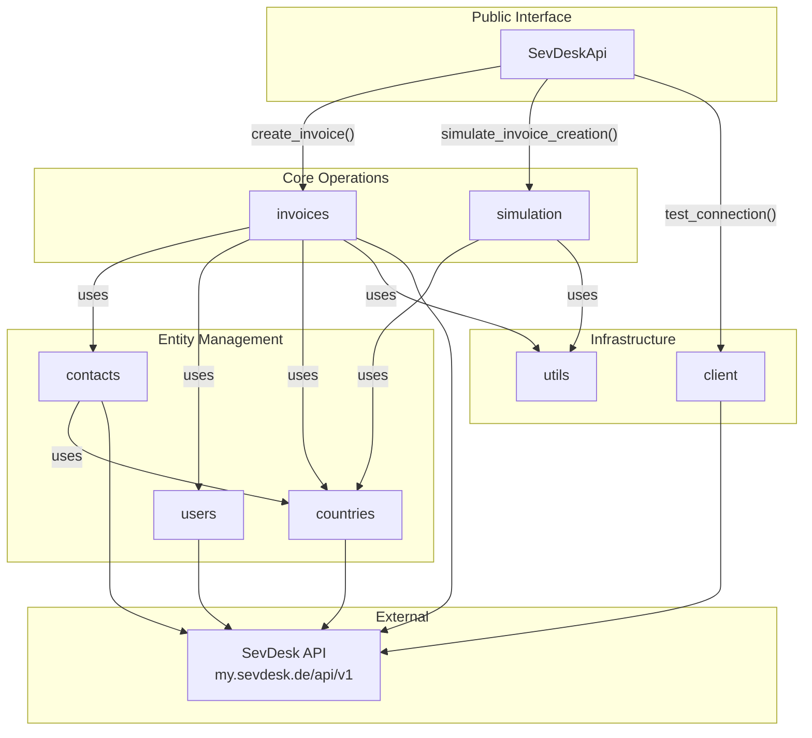
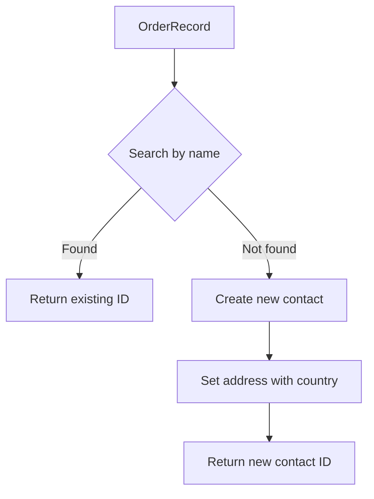
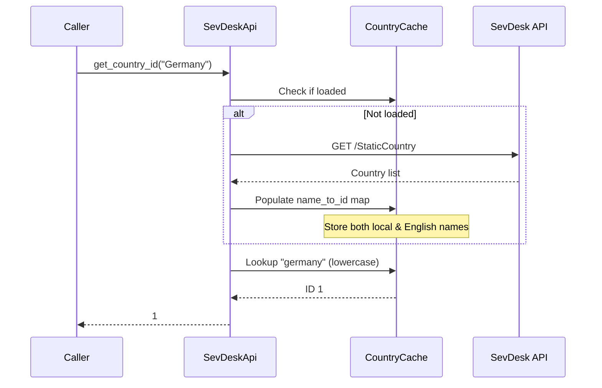
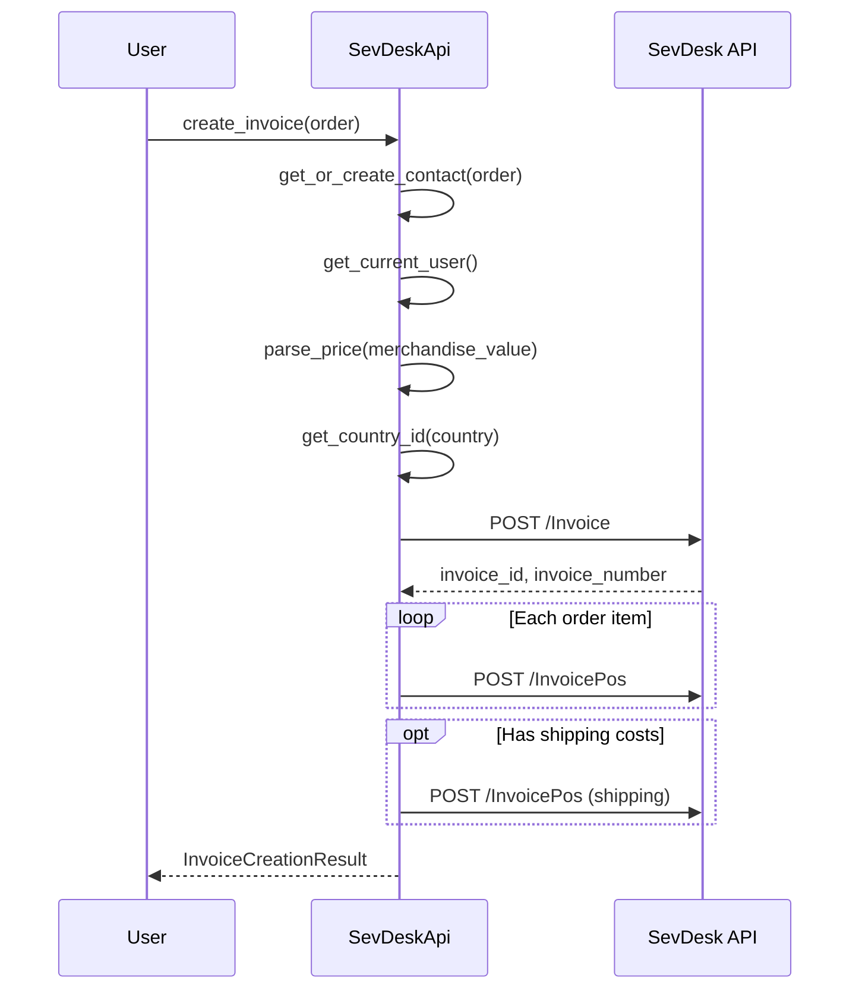
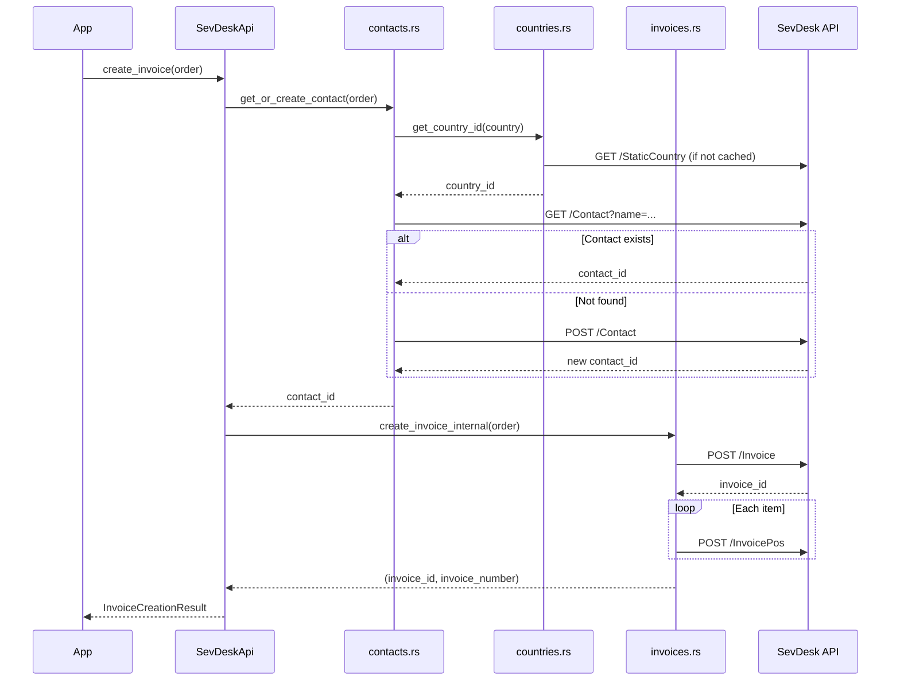

# SevDesk API Module

This module provides functionality for interacting with the SevDesk API to create invoices, manage contacts, and handle country lookups with caching.

## Architecture Overview



## Module Structure

```
sevdesk_api/
├── mod.rs           # SevDeskApi struct definition & re-exports
├── client.rs        # HTTP client wrapper, connection testing
├── contacts.rs      # Customer/contact CRUD operations
├── countries.rs     # Country ID resolution with caching
├── invoices.rs      # Invoice creation and line items
├── simulation.rs    # Dry-run validation without API calls
├── users.rs         # User information retrieval
├── utils.rs         # Price parsing utilities
└── tests/           # Unit tests
    ├── mod.rs
    ├── construction_tests.rs
    ├── countries_tests.rs
    ├── models_tests.rs
    └── utils_tests.rs
```

## Components

### SevDeskApi (mod.rs)

The main API client that provides access to all SevDesk operations.

```rust
pub struct SevDeskApi {
    client: Client,
    api_token: String,
    base_url: String,
    country_cache: Arc<RwLock<CountryCache>>,
}

impl SevDeskApi {
    pub fn new(api_token: String) -> Self;
    pub async fn create_invoice(&self, order: &OrderRecord) -> Result<InvoiceCreationResult>;
    pub async fn simulate_invoice_creation(&self, order: &OrderRecord) -> Result<InvoiceCreationResult>;
    pub async fn test_connection(&self) -> Result<bool>;
}
```

**Responsibilities:**
- Hold HTTP client and authentication
- Provide thread-safe country caching
- Expose high-level API operations

### client.rs

HTTP client wrapper and connection testing.

```rust
impl SevDeskApi {
    pub async fn test_connection(&self) -> Result<bool>;
}
```

**Responsibilities:**
- Test API connectivity
- Verify authentication token validity

### contacts.rs

Customer/contact management via SevDesk Contact API.

```rust
impl SevDeskApi {
    async fn get_or_create_contact(&self, order: &OrderRecord) -> Result<u32>;
}
```

**Contact Flow:**


### countries.rs

Country ID resolution with in-memory caching.

```rust
struct CountryCache {
    name_to_id: HashMap<String, u32>,
    loaded: bool,
}

impl SevDeskApi {
    async fn fetch_countries(&self) -> Result<()>;
    async fn get_country_id(&self, country_name: &str) -> Result<u32>;
}
```

**Caching Strategy:**


**Cache Features:**
- Case-insensitive lookups
- Stores both local and English country names
- Common aliases (e.g., "UK" → "United Kingdom")
- Partial matching fallback
- Defaults to Germany (ID: 1) if unknown

### invoices.rs

Invoice creation and line item management.

```rust
impl SevDeskApi {
    pub async fn create_invoice(&self, order: &OrderRecord) -> Result<InvoiceCreationResult>;
    async fn create_invoice_internal(&self, order: &OrderRecord) -> Result<(String, String)>;
    async fn add_invoice_position(&self, invoice_id: &str, ...) -> Result<()>;
}
```

**Invoice Creation Flow:**


**Kleingewerbe Tax Handling:**
- Tax rate: 0% (no VAT)
- Tax rule ID: 11 (Kleinunternehmerregelung §19 UStG)
- Price net = Price gross

### simulation.rs

Dry-run invoice validation without API calls.

```rust
impl SevDeskApi {
    pub async fn simulate_invoice_creation(&self, order: &OrderRecord) -> Result<InvoiceCreationResult>;
    async fn simulate_invoice_validation(&self, order: &OrderRecord) -> Result<String>;
}
```

**Validation Checks:**
| Check | Description |
|-------|-------------|
| Country mapping | Validates country can be resolved to ID |
| Price parsing | Validates all price fields are parseable |
| Items validation | Logs what invoice positions would be created |

**Note:** Simulation still calls the country API (for cache population) but does NOT create any invoices or contacts.

### users.rs

User information retrieval for invoice contact person.

```rust
impl SevDeskApi {
    async fn get_current_user(&self) -> Result<u32>;
}
```

### utils.rs

Pure utility functions for data transformation.

```rust
impl SevDeskApi {
    fn parse_price(&self, price_str: &str) -> Result<f64>;
}
```

| Function | Input | Output | Description |
|----------|-------|--------|-------------|
| `parse_price` | `"5,00"` or `"5.00"` | `5.0` | Handles comma/dot decimals |

## Data Flow



## Usage Example

```rust
use sevdesk_invoicing::sevdesk_api::SevDeskApi;
use sevdesk_invoicing::models::OrderRecord;

#[tokio::main]
async fn main() -> anyhow::Result<()> {
    let api = SevDeskApi::new("your_api_token".to_string());
    
    // Test connection
    if api.test_connection().await? {
        println!("✓ Connected to SevDesk API");
    } else {
        eprintln!("✗ Connection failed");
        return Ok(());
    }
    
    // Simulate invoice creation (dry run)
    let order: OrderRecord = /* ... */;
    let simulation = api.simulate_invoice_creation(&order).await?;
    
    if simulation.error.is_none() {
        println!("✓ Simulation passed: {}", simulation.invoice_number.unwrap());
        
        // Create real invoice
        let result = api.create_invoice(&order).await?;
        
        match result.error {
            None => println!("✓ Invoice created: {}", result.invoice_number.unwrap()),
            Some(err) => eprintln!("✗ Failed: {}", err),
        }
    }
    
    Ok(())
}
```

## API Endpoints Used

| Endpoint | Method | Purpose |
|----------|--------|---------|
| `/Tools/bookkeepingSystemVersion` | GET | Connection test |
| `/StaticCountry` | GET | Fetch country list |
| `/Contact` | GET | Search contacts by name |
| `/Contact` | POST | Create new contact |
| `/SevUser` | GET | Get current user |
| `/Invoice` | POST | Create invoice |
| `/InvoicePos` | POST | Add invoice line item |

## Testing

Unit tests are in the `tests/` subdirectory:

- **construction_tests.rs** - API client construction
- **countries_tests.rs** - Country cache functionality
- **models_tests.rs** - Model types (OrderRecord, InvoiceCreationResult)
- **utils_tests.rs** - Price parsing utilities

Run tests:
```bash
cargo test sevdesk_api
```

**Note:** All tests are offline-only and do not contact the real SevDesk API.
