# MTG Stock Checker

A desktop application for Magic: The Gathering card inventory management and stock analysis. Built with Rust and egui for a fast, native GUI experience.

## Features

### 🔍 Stock Checker
Compare your inventory against a wantslist to find matching cards:
- **Multi-language support**: Search across English, German, Spanish, French, and Italian card names
- **Flexible matching**: Optionally restrict results to preferred language only
- **Multiple output formats**:
  - **Picking List**: For warehouse order fulfillment with location codes
  - **Invoice List**: Formatted for customer invoices
  - **Stock Update CSV**: Export for bulk inventory updates
- **Discount calculation**: Apply percentage discounts to total price
- **Card selection**: Pick specific copies when multiple matches exist

### 📊 Stock Analysis
Analyze your inventory storage bins:
- View bin capacity utilization
- Find bins with available slots
- Filter by minimum free slots
- Sort by location or available space

### 🔎 Card Search
Search your inventory interactively:
- Real-time search with debouncing
- Filter by set, language, condition
- View card details and locations

## Architecture

### High-Level Overview


### Module Structure


### Data Flow - Stock Checking


### Core Components

#### `models.rs`
Domain models representing the core data structures:

| Type | Purpose |
|------|---------|
| `Card` | Represents a card in inventory with all attributes (name, set, condition, price, location, etc.) |
| `Language` | Enum for supported languages with parsing and conversion helpers |
| `WantsEntry` | A single entry from a wantslist (quantity + card name) |

#### `io.rs`
File I/O operations:
- `read_csv()`: Parse Cardmarket-format inventory CSV exports
- `read_wantslist()`: Parse simple "quantity name" format wantslists

#### `card_matching.rs`
Card matching and search logic:
- Multi-language name matching
- Language preference sorting
- Price-based sorting for optimal matches
- Quantity aggregation across sets

#### `formatters.rs`
Output formatting for different use cases:
- `format_regular_output()`: Human-readable match results
- `format_picking_list()`: Warehouse picking with locations
- `format_invoice_list()`: Customer invoice format
- `format_update_stock_csv()`: CSV export for stock updates

#### `stock_analysis.rs`
Inventory bin analysis:
- Bin capacity tracking (60 cards per bin)
- Free slot calculation
- Location-based sorting

### UI Architecture

```mermaid
stateDiagram-v2
    [*] --> Welcome
    Welcome --> StockChecker: "Stock Checker" button
    Welcome --> StockAnalysis: "Stock Analysis" button
    Welcome --> Search: "Search Cards" button
    
    StockChecker --> Welcome: "← Back"
    StockAnalysis --> Welcome: "← Back"
    Search --> Welcome: "← Back"
```



The UI follows a simple screen-based navigation pattern:
- **AppState**: Shared state for the stock checker screen
- **StockAnalysisState**: Isolated state for bin analysis
- **SearchState**: Isolated state for card search

## Usage

### Building

```bash
cd check_stock
cargo build --release
```

The optimized binary will be at `target/release/d2d_automations`.

### Running

```bash
# With default debug logging
cargo run --release

# With different log levels
RUST_LOG=info cargo run --release
RUST_LOG=warn cargo run --release
RUST_LOG=d2d_automations=trace cargo run --release
```

### Input File Formats

#### Inventory CSV (Cardmarket Export)
Standard Cardmarket stock export with columns:
- `cardmarketId`, `quantity`, `name`, `set`, `setCode`, `cn`
- `condition`, `language`, `isFoil`, `isPlayset`, `isSigned`
- `price`, `comment`, `location`
- `nameDE`, `nameES`, `nameFR`, `nameIT` (localized names)
- `rarity`, `listedAt`

#### Wantslist
Simple text file, one entry per line:
```
4 Lightning Bolt
2 Counterspell
1 Black Lotus
```

Lines starting with "Deck" are ignored (supports MTG deck export formats).

### Output Formats

#### Picking List
Optimized for warehouse picking with:
- Cards grouped by location prefix
- Sorted by bin location for efficient walking
- Quantity indicators

#### Invoice List
Customer-facing format with:
- Card names and quantities
- Prices with optional discount
- Total calculations

#### Stock Update CSV
For bulk updates:
- Cardmarket-compatible format
- Reduced quantities for matched cards

## Development

### Project Structure

```
check_stock/
├── Cargo.toml
├── README.md
├── src/
│   ├── main.rs              # Entry point, logger init
│   ├── lib.rs               # Public API exports
│   ├── models.rs            # Domain models
│   ├── io.rs                # File I/O
│   ├── card_matching.rs     # Matching logic
│   ├── formatters.rs        # Output formatters
│   ├── stock_analysis.rs    # Bin analysis
│   └── ui/
│       ├── mod.rs
│       ├── app.rs           # Main app, screen routing
│       ├── state.rs         # Application state
│       ├── language.rs      # UI language enum
│       ├── components/      # Reusable UI components
│       └── screens/         # Screen implementations
│           ├── mod.rs
│           ├── welcome.rs
│           ├── stock_checker.rs
│           ├── stock_analysis.rs
│           └── search.rs
└── tests/
    ├── io_tests.rs
    ├── performance_tests.rs
    └── fixtures/            # Test data files
```

### Running Tests

```bash
cargo test
```

### Code Quality

```bash
./run_quality_checks.sh
# Or manually:
cargo clippy -- -D warnings
cargo fmt --check
```

### Dependencies

| Crate | Purpose |
|-------|---------|
| `eframe` | Native GUI framework (egui backend) |
| `csv` | CSV parsing |
| `serde` | Serialization/deserialization |
| `chrono` | Date/time handling |
| `rfd` | Native file dialogs |
| `regex` | Pattern matching |
| `log` + `env_logger` | Logging infrastructure |

## License

Part of the d2d_automations project.
